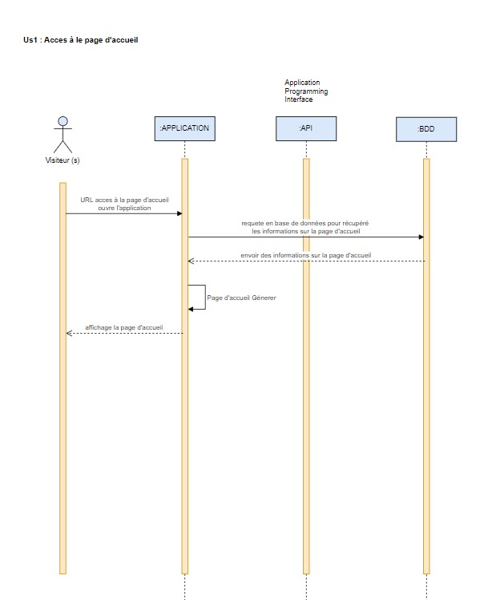

# README - Garage Vincent Parrot

1. Présentation du Projet
Ce projet consiste en la création d'un site web pour le Garage Vincent Parrot, permettant la gestion des véhicules d’occasion ainsi que la présentation des services du garage. Le site inclut une galerie de véhicules, une interface de gestion pour les employés et un système de filtrage dynamique pour faciliter la recherche. Ce README décrit les étapes de développement, les compétences appliquées, et la documentation technique.

2. Objectifs et Contexte
L'objectif de ce projet est de fournir une plateforme intuitive et sécurisée pour :

Présenter les véhicules et services proposés.
Permettre une gestion efficace des véhicules par les employés.
Offrir aux visiteurs un moyen simple de trouver et de contacter le garage.

3. Structure du Projet
Dossier/Fichier	Description
/docs	Contient les diagrammes UML et les modèles de données (MCD, MLD, MPD).
/design	Inclut les wireframes, mockups et charte graphique.
/src	Code source (HTML, CSS, PHP, JavaScript) structuré par fonctionnalité.
/assets/images	Dossier contenant les images des véhicules.
README.md	Ce fichier, qui documente le projet.

4. Compétences et Pratiques Appliquées
# 4.1 Analyse des Besoins
Tâches :

Réalisation d’une analyse des besoins pour définir les fonctionnalités principales : gestion des véhicules, système de filtrage, accès au tableau de bord employé.
Création des cas d'utilisation UML pour décrire les interactions principales (ex : ajout de véhicule, demande de contact).
Compétences :

Communication avec le client pour déterminer les attentes.
Transformation des besoins en fonctionnalités techniques détaillées.

# 4.2 Conception Technique
Tâches :

Création des modèles de données (MCD, MLD, MPD) pour structurer la base de données.
Élaboration des diagrammes de séquence pour représenter les flux de données entre les utilisateurs et le site.
Compétences :

Structuration des données en tenant compte des relations et de la sécurité.
Utilisation de modèles UML pour planifier les interactions et la structure des données.

<!------------------------------------------------------------->
# Projet Exemple

## Diagramme de l'Architecture
Voici le diagramme de l'architecture du projet :

## Description
Ce projet est un exemple de documentation utilisant Markdown.
<!------------------------------------------------------------->

# 4.3 Développement Front-End
Tâches :

Création des interfaces utilisateur avec HTML et CSS, en respectant les wireframes et la charte graphique.
Utilisation de JavaScript pour implémenter le filtrage dynamique et les interactions (ex : redirection du bouton Détails vers la page spécifique).
Compétences :

Application des principes de responsive design pour garantir une expérience utilisateur optimale sur tous les appareils.
Création de fonctionnalités interactives et dynamiques pour améliorer l'expérience utilisateur.

# 4.4 Développement Back-End
Tâches :

Création de l'interface employé en PHP pour la gestion des véhicules (ajout, modification, suppression).
Implémentation de la base de données et connexion avec PHP pour rendre le contenu dynamique.
Compétences :

Maîtrise des requêtes SQL et des clés étrangères pour maintenir l'intégrité des données.
Sécurisation des connexions et du stockage des mots de passe avec des hachages.

# 4.5 Tests et Optimisation
Tâches :

Tests d'intégration pour s'assurer du bon fonctionnement des interactions (ex : filtrage, redirection vers la fiche du véhicule).
Résolution des problèmes d'affichage des images et optimisation du code pour une performance maximale.
Compétences :

Debugging et optimisation des performances pour garantir un site rapide et fiable.
Validation des fonctionnalités par rapport aux besoins initiaux du client.
# 4.6 Documentation et Mise en Production
Tâches :

Rédaction d'une documentation technique (README, commentaires de code) pour faciliter la maintenance et la prise en main du projet.
Organisation et présentation des livrables pour une présentation professionnelle des compétences.
Compétences :

Documentation détaillée pour assurer la pérennité et la facilité de maintenance du projet.
Présentation structurée et professionnelle des compétences et des pratiques appliquées.

5. Instructions d’Installation et d’Utilisation
Prérequis
Serveur Web avec PHP 7.4+
MySQL
Navigateur Web moderne

# Installation
Clonez le dépôt :
bash
Copier le code
git clone https://github.com/votre_projet/garage-vincent-parrot.git
Importez la base de données (fichier garage_vincent_parrot.sql) dans MySQL.

# Configurez le fichier src/utilise.php pour la connexion à la base de données :
php
Copier le code
'host' => 'localhost',
'db' => 'garage_vincent_parrot',
'user' => 'root',
'password' => 'votre_mot_de_passe',

# Utilisation
Accédez à la galerie de véhicules pour consulter les annonces.
Utilisez l’interface employé pour gérer les véhicules.

6. Diagrammes UML et Documentation Visuelle
Les diagrammes UML et autres documents de conception visuelle sont disponibles dans le dossier /docs et /design :

## Diagrammes : cas d’utilisation, séquences, classes.
Modèles de données : MCD, MLD, MPD.
Wireframes et charte graphique pour référence visuelle.

7. Suivi des Prochaines Étapes
Amélioration des fonctionnalités de filtrage et ajout de nouvelles options.
Optimisation du code PHP pour une gestion plus rapide de la base de données.
Éventuelle intégration d'une API pour des données de prix en temps rée

8. Gestion et Suivi de Projet
Le projet a été structuré et suivi via un backlog sur Trello, permettant d’organiser les tâches, de prioriser les fonctionnalités et de garantir une gestion itérative. Ce backlog inclut :

Les fonctionnalités à développer (avec leur priorité).
Les tâches en cours et terminées.
Les éventuelles améliorations et retours du client.
Le tableau Trello est accessible ici : Backlog Trello - Garage Vincent Parrot.

## Ressources du projet
### Maquettes du projet
- [Maquettes Figma](https://www.figma.com/design/I1yGQy71smxfwwQFWgvCdE/ECF-Projet-Parrot?node-id=21-20&t=jsRj49fHSf8JF9qe-1)
### Suivi du projet
- [Tableau Trello](https://trello.com/b/kjFier8C/ecf-projet-parrot-studi-v12_id)

# SECONDE PARTIE
=======
ECF Garage v.parrot Evaluation en court de formation studi

Mon ECF Bienvenue sur le site v.Parrot, concernant les services automobile et véhicules d'occasion.

Comment exécuter le site en local Clonez ce dépôt sur votre machine locale. Ouvrez le fichier accueil.html dans votre navigateur. Personnalisation Si vous souhaitez personnaliser l'animation ou les styles, vous pouvez modifier le fichier styles.css pour apporter les changements souhaités.

Contenu du README Description du projet et de ses objectifs : Le projet Garage V. Parrot vise à créer une application web vitrine pour promouvoir les services offerts par le Garage V. Parrot, une entreprise spécialisée dans la réparation automobile à Toulouse. L'objectif principal est de présenter de manière claire et attrayante les services de réparation de carrosserie et de mécanique, l'entretien régulier des véhicules, ainsi que la vente de véhicules d'occasion. Le projet met en avant l'expertise et l'engagement du garage envers la satisfaction client, tout en améliorant sa visibilité en ligne pour attirer de nouveaux clients.

Utilité du projet pour les utilisateurs : Les utilisateurs de l'application web vitrine pourront découvrir facilement les services proposés par le Garage V. Parrot, ainsi que les avantages de faire confiance à cette entreprise pour leurs besoins en réparation et entretien automobile. En offrant une présentation claire et détaillée des services, le projet vise à informer et à rassurer les clients potentiels sur la qualité et la fiabilité des prestations fournies par le garage.

Instructions pour prendre en main le projet :

Accès à l'application web vitrine : o Pour commencer, les utilisateurs peuvent accéder à l'application web vitrine en ouvrant leur navigateur web préféré et en entrant l'URL fournie.
Navigation sur la page d'accueil : o Une fois sur la page d'accueil, les utilisateurs seront accueillis par une interface conviviale et intuitive. o Ils pourront explorer les différents services proposés par le Garage V. Parrot grâce à une navigation claire et bien structurée.
Découverte des services : o Les utilisateurs trouveront des sections dédiées présentant en détail chaque type de service offert par le garage, notamment la réparation de carrosserie et de mécanique, l'entretien régulier des véhicules, et la vente de véhicules d'occasion. o Chaque section fournira des informations complètes sur les procédures, les tarifs et les garanties associées à chaque service.
Formulaire de contact : o En cas de questions supplémentaires ou de demandes spécifiques, un formulaire de contact sera mis à la disposition des utilisateurs. o Ce formulaire leur permettra d'entrer en communication directe avec le Garage V. Parrot, garantissant ainsi une réponse rapide et personnalisée à leurs besoins. En suivant ces instructions simples, les utilisateurs pourront facilement découvrir et explorer les services offerts par le Garage V. Parrot, tout en ayant la possibilité d'entrer en contact direct avec l'entreprise pour toute demande d'information supplémentaire.
Ressources d'aide disponibles pour les utilisateurs :

Section d'aide intégrée : o En cas de questions ou de problèmes rencontrés lors de l'utilisation de l'application web vitrine, les utilisateurs peuvent accéder à la section d'aide intégrée à l'interface. o Cette section fournit des réponses aux questions fréquemment posées, ainsi que des instructions détaillées sur l'utilisation des différentes fonctionnalités de l'application.
Service clientèle : o En plus de la section d'aide, un service clientèle dédié est disponible pour répondre aux demandes spécifiques des utilisateurs. o Les utilisateurs peuvent contacter le service clientèle par le biais du formulaire de contact disponible sur l'application web vitrine. o L'équipe du service clientèle s'engage à fournir une assistance personnalisée et efficace pour résoudre tout problème ou répondre à toute question dans les meilleurs délais. En fournissant ces ressources d'aide, le projet Garage V. Parrot s'efforce de garantir une expérience utilisateur fluide et satisfaisante, en offrant aux utilisateurs les moyens de trouver des solutions à leurs préoccupations et de recevoir une assistance personnalisée au besoin.
Informations sur la maintenance et les contributions au projet :

Maintenance du projet : o Le projet Garage V. Parrot sera continuellement surveillé et maintenu par une équipe dédiée de développeurs et de gestionnaires. o Les mises à jour régulières seront effectuées pour garantir le bon fonctionnement de l'application web vitrine, ainsi que pour répondre aux besoins évolutifs des utilisateurs et de l'entreprise.
Contributions au projet : o Les contributions à l'amélioration du projet sont les bienvenues de la part de la communauté des développeurs. o Les contributeurs peuvent proposer des suggestions d'amélioration, signaler des bugs, ou soumettre des demandes de fonctionnalités via le processus de suivi des problèmes (issue tracking) sur le dépôt GitHub du projet. o Les contributions seront évaluées et intégrées au projet par l'équipe de développement, dans le respect des normes de qualité et de cohérence établies. En favorisant la transparence et la collaboration, le projet Garage V. Parrot encourage la participation active de la communauté des développeurs, tout en s'engageant à assurer la maintenance continue et l'amélioration constante de l'application web vitrine pour le bénéfice de ses utilisateurs.
=======
ECF Garage v.parrot
Evaluation en court de formation studi

Mon ECF
Bienvenue sur le site v.Parrot, concernant les services automobile et véhicules d'occasion.

Comment exécuter le site en local
Clonez ce dépôt sur votre machine locale.
Ouvrez le fichier accueil.html dans votre navigateur.
Personnalisation
Si vous souhaitez personnaliser l'animation ou les styles, vous pouvez modifier le fichier styles.css pour apporter les changements souhaités.
